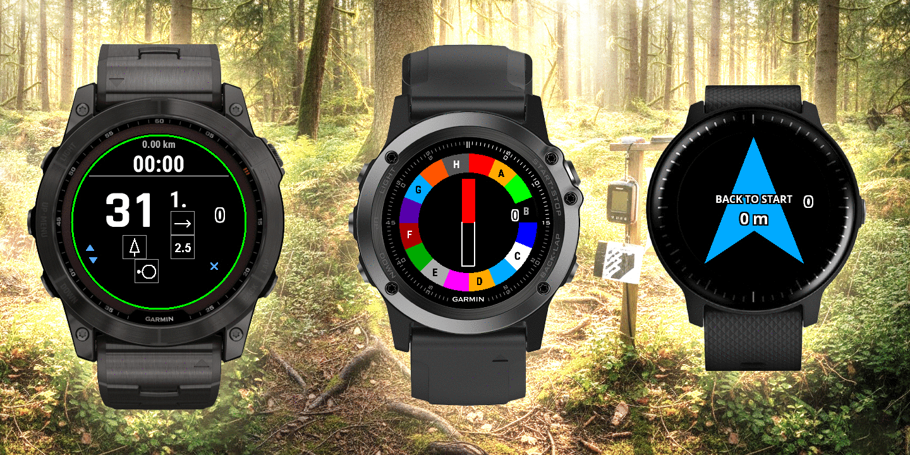

  

# LegendMaster 🏃‍♂️🧭

**LegendMaster** is a high-performance ecosystem designed specifically for **Sport Orienteering**. It consists of a Garmin Watch application and an Android companion app, providing a seamless digital experience while strictly following international standards.

---

## ✨ Key Features

### ⌚ Garmin Watch Application
- **Classic Orienteering Compass:** High-contrast, stable, and responsive heading UI.
- **ISOM 2024 Legend Gallery:** Full support for the latest International Specification for Orienteering Maps symbols.
- **Safety "Back to Start":** Real-time arrow and distance navigation to return to the starting point.
- **Smart SPOOF Detection:** Automatic detection of GPS signal anomalies (optimized for UA region).
- **Advanced Tracking:** - Real-time step-to-paces conversion.
- Standard FIT file recording for Strava, Garmin Connect, and Livelox.
- Multi-page UI: Compass, Legends, Navigation, and Professional Metrics.

### 📱 Android Companion App (Android 9+)
- **Visual Course Builder:** Create complex CP legends using a visual ISOM picker.
- **Wireless Bluetooth Sync:** Instant data transmission to your Garmin watch.
- **JSON Support:** Import and export your race data via JSON strings for easy sharing.

---

## 🛠 Tech Stack
- **Watch App:** Monkey C (Garmin Connect IQ SDK).
- **Mobile App:** Kotlin, Android SDK (Min API 28).
- **Communication:** Garmin ConnectIQ Mobile SDK (BLE).

---

## 🚀 Getting Started

### 1. Watch App Setup (Garmin)
1. Open the `/watch_activity` folder in VS Code.
2. Ensure you have the **Monkey C extension** installed.
3. **Crucial:** Generate your developer key (`developer_key.der`) and place it in the project root (do not commit this key!).
4. Build the project and side-load the `.prg` file to your device.

### 2. Android App Setup
1. Open the `/android_app` project in Android Studio.
2. **Configuration:** Open `ControlEditorActivity.kt` and update the `APP_ID` to match your Garmin manifest UUID.
3. Build the APK and install it on your Android device.

---

## 📁 Repository Structure
├── android_app/      # Kotlin source code (Mobile Companion)
├── watch_activity/   # Monkey C source code (Garmin App)
└── README.md